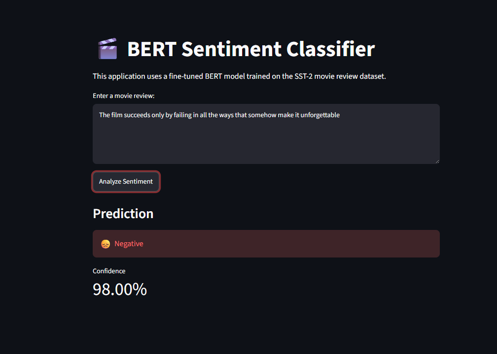
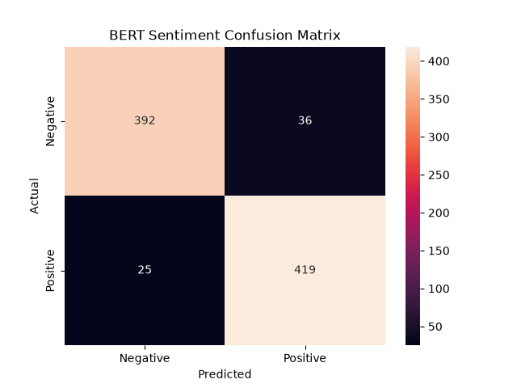
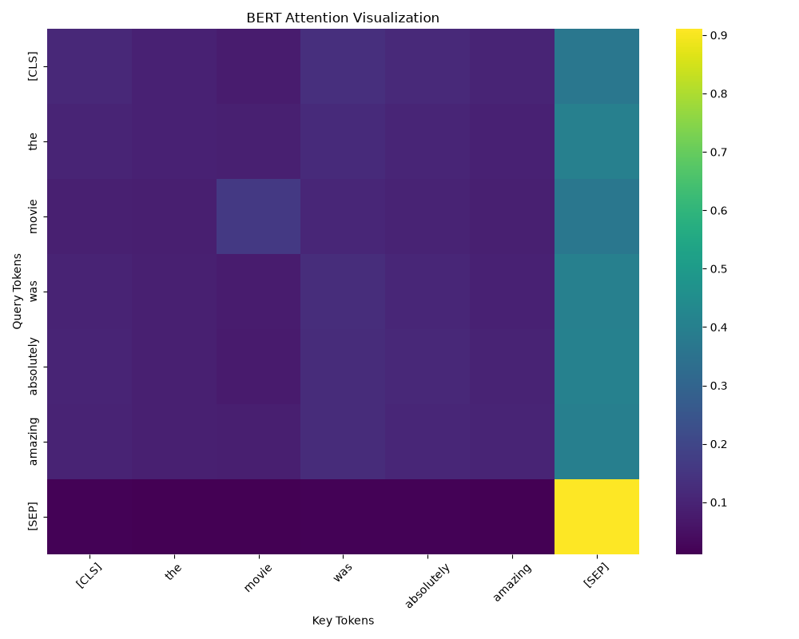

# BERT Sentiment Classifier

A fine-tuned BERT-based sentiment classification system using Hugging Face Transformers and PyTorch.

The project classifies movie reviews into positive and negative sentiment using transfer learning with BERT. It includes model training, evaluation, error analysis, attention visualization, inference, and a Streamlit deployment interface.

## Demo



---

## Tech Stack

- Hugging Face Transformers — BERT fine-tuning and inference
- PyTorch — deep learning framework and GPU acceleration
- Hugging Face Datasets — SST-2 dataset pipeline
- scikit-learn — evaluation metrics
- Streamlit — interactive web application
- Matplotlib / Seaborn — visualization

---

## Project Structure

```text
sentiment-analysis-bert-huggingface/

├── app.py                         ← Streamlit application
├── requirements.txt               ← Dependencies

├── saved_model/                   ← Fine-tuned BERT model

├── reports/
│   ├── confusion_matrix.png       ← Evaluation visualization
│   └── attention_heatmap.png      ← BERT attention visualization

├── screenshots/
│   └── streamlit_demo.png         ← Application screenshot

└── src/
    ├── train.py                   ← BERT fine-tuning
    ├── evaluate.py                ← Model evaluation
    ├── error_analysis.py          ← Prediction error analysis
    ├── attention.py               ← Attention visualization
    ├── predict.py                 ← Single text inference
    ├── dataset.py                 ← Dataset processing
    ├── model.py                   ← Model utilities
    ├── metrics.py                 ← Evaluation metrics
    ├── config.py                  ← Configuration
    ├── save_model.py              ← Save model
    └── save_best_model.py         ← Export final model
```

---

## Dataset

### SST-2 (Stanford Sentiment Treebank)

A binary sentiment classification dataset from the GLUE benchmark.

Labels:

```
0 → Negative
1 → Positive
```

Example:

Input:

```
The movie was absolutely fantastic.
```

Prediction:

```
Positive
```

---

## Model

Model:

```
bert-base-uncased
```

Architecture:

```
Input Text
    ↓
BERT Tokenizer
    ↓
BERT Encoder
    ↓
Classification Head
    ↓
Softmax
    ↓
Sentiment Prediction
```

---

## Training

The model is fine-tuned using transfer learning.

Training process:

```
SST-2 Dataset
      ↓
Tokenization
      ↓
BERT Fine-tuning
      ↓
Saved Model
```

Training environment:

```
GPU: NVIDIA GeForce RTX 4060
VRAM: 8GB

PyTorch: 2.13.0 + CUDA 12.6
```

---

## Evaluation

Validation performance:

| Metric | Score |
|--------|-------|
| Accuracy | 93.00% |
| Precision | 92.09% |
| Recall | 94.37% |
| F1 Score | 93.21% |

Confusion matrix:



---

## Error Analysis

The project includes an error analysis pipeline to understand incorrect predictions.

Run:

```bash
python src/error_analysis.py
```

The analysis identifies:

- Incorrect predictions
- Actual labels
- Predicted labels
- Confidence scores

This helps understand model limitations such as:

- Sarcasm
- Negation
- Context dependency

---

## Attention Visualization

BERT attention patterns can be visualized using:

```bash
python src/attention.py
```

Output:



The visualization shows how transformer attention connects different tokens during prediction.

---

## Inference

Run prediction from terminal:

```bash
python src/predict.py
```

Example:

Input:

```
This movie was excellent and entertaining.
```

Output:

```
Sentiment: Positive
Confidence: 99%
```

---

## Streamlit Application

Launch:

```bash
streamlit run app.py
```

Features:

- Text input interface
- Sentiment prediction
- Confidence score display

---

## Model Storage

The trained BERT model is stored using Git LFS because transformer models exceed GitHub's normal file size limit.

Stored:

```
saved_model/

├── model.safetensors
├── config.json
├── tokenizer.json
└── tokenizer files
```

---

## Future Improvements

- Deploy Streamlit application online
- Add experiment tracking with Weights & Biases
- Compare BERT with DistilBERT and RoBERTa
- Add explainability methods such as Integrated Gradients

---

## About

A complete NLP engineering project demonstrating transformer fine-tuning, evaluation, interpretability, and deployment using BERT and Hugging Face Transformers.

Topics:

```
nlp
bert
transformers
huggingface
sentiment-analysis
pytorch
deep-learning
streamlit
```